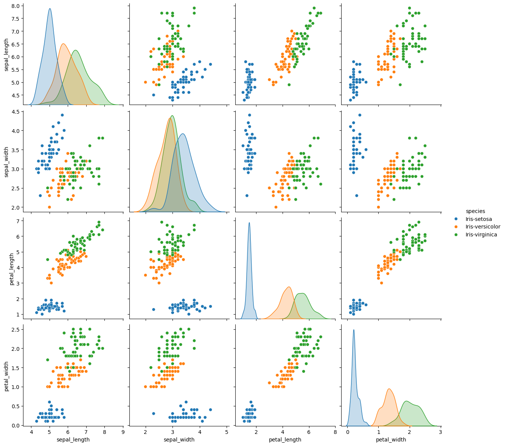
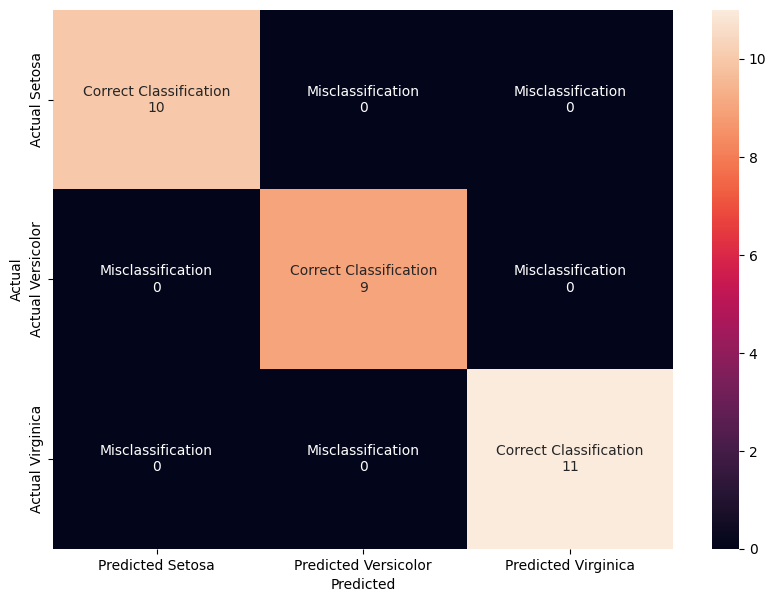

# Iris-Flower-Classification

![[Iris Flowers]|100](assets/iris_flowers.png)

The Iris flower data set or Fisher's Iris data set is a multivariate data set that contains 50 samples from each of three species of Iris (Iris Setosa, Iris Virginica, and Iris Versicolor).

The [data set](IRIS.csv) contains a set of 150 records under 5 attributes:
- Petal Length, Petal Width, Sepal Length, Sepal width, and Species

## Objective

Many coders jump straight into using machine learning frameworks (PyTorch, TensorFlow, Keras, Theano) without understanding what's happening "under the hood". Nowadays, it's hard to even find the infamous Iris Classification solved without using such tools. It's important we take the time to understand neural network fundamentals.

That's why in this project, I created a [Jupyter tutorial](iris_classification.ipynb) demonstrating how to **hand-code** a deep learning model that uses a neural network to identify each species of Iris. No machine learning frameworks were used to build the model itself. The network is a multilayer perceptron with one hidden layer (two neurons), coded with Python, and 100% accuracy.

### Jupyter Notebook tutorial detailing the project step-by-step --> [**here**](iris_classification.ipynb)
Click [here](iris_classification_NN.py) for just the source code.

## Getting Started
### Python Environment
Download and install Python 3.8 or higher from the [official Python website](https://www.python.org/downloads/)

Optional, but I would recommend creating a venv. For Windows installation:
```
py -m venv .venv
.venv\Scripts\activate
```
For Unix/macOS:
```
python3 -m venv .venv
source .venv/bin/activate
```

Now install the necessary AI stack in the venv terminal. These libraries will aid with computational coding, data visualization, accuracy reports, preprocessing, etc.
```
pip install numPy
pip install matplotlib
pip install pandas
pip install scikit-learn
pip install seaborn
```
Note: sklearn was **not** used to create the model or for supervised learning. For more details on how I used libraries, visit the Jupyter Notebook tutorial I made [here.](iris_classification.ipynb)

### Data Input
To input data from the Iris data set, make sure to replace ... with your correct file path. Use the pandas library:
```
data = pd.read_csv('...\IRIS.csv')
```

### Data Visualization
In the Jupyter Notebook, there are more plots/graphs. Here I will just use a pairplot to summarize:

Using [seaborn](https://seaborn.pydata.org) and [matplotlib.pyplot](https://matplotlib.org), create a pairplot. This graph visualizes the relationship between each pair of variables in the Iris data set. Since there are four inputs, you will notice the plot becomes a 4x4 with 16 plots in total.
```
sns.pairplot(data, hue= 'species', height= 3)
plt.show()
```


## Discussion of Results
### Confusion Matrix
A confusion matrix is a table used to evaluate the performance of my classification model. It provides a detailed breakdown of the actual versus predicted classifications, allowing us to see where the model is making correct and incorrect predictions.



As we can see, the confusion matrix of my neural network demonstrates 100% accuracy. There are zero misclassifications, and all instances of Setosa, Virginica, and Versicolor are correctly identified. In total, 30 entrees were tested, with the other 120 used for training. The code for the confusion matrix can be found [here.](iris_classification.ipynb)

### Classification Report
The classification report is another way of analyzing the deep learning behavior. It provides key metrics that evaluate the performance of the model, such as: precision, recall, and F1-score for each class, along with the overall accuracy.
```
              precision    recall  f1-score   support

      setosa       1.00      1.00      1.00        10
  versicolor       1.00      1.00      1.00         9
   virginica       1.00      1.00      1.00        11

    accuracy                           1.00        30
   macro avg       1.00      1.00      1.00        30
weighted avg       1.00      1.00      1.00        30
```
In the Jupyter Notebook, I go more in-depth about what these metrics mean.

# Click [here](iris_classification.ipynb) to see the tutorial + details


